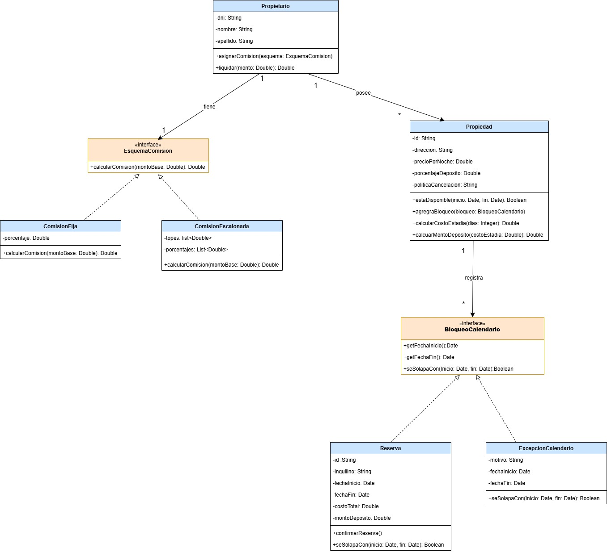
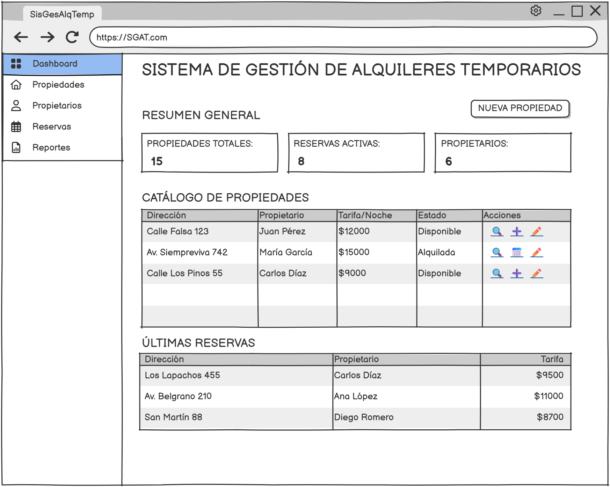

# Diseño y Planificación - Iteración 1

---

## Trabajo en equipo

A continuación se detalla el trabajo planificado y asignado a cada integrante para esta iteración:

| Integrante         | Tareas Asignadas (Basadas en la sección "Tareas") |
|--------------------|---------------------------------------------------|
| **Bauer Luciano** | HU-01: Gestión de Propietarios HU-02: Esquemas de Comisión HU-04: Asociación Propiedad-Propietario |
| **Olivieri Ricardo** | HU-03: Gestión de Propiedades HU-05: Excepciones de Calendario HU-06: Validación de Disponibilidad HU-07: Registro de Reservas |

*(Nota: El modelado de clases, la redacción de requerimientos y la definición de wireframes se realizaron en conjunto).*

---

## Diseño OO

El siguiente diagrama de clases UML refleja el modelo de dominio diseñado exclusivamente para esta iteración:

---

## Wireframe y caso de uso

La siguiente imagen refleja como se veria la pantalla del Dashboard:

---

## Backlog de iteración

A continuación, se enumeran las **7 Historias de Usuario (HUs)** que se implementarán en esta iteración para alcanzar el 50% de funcionalidad del proyecto:

### **HU-01: Gestión de Propietarios**
> **Como** administrador,  
> **quiero** registrar y modificar los datos de los propietarios del sistema,  
> **para** mantener el padrón actualizado.

**Criterios de aceptación:**
- Puedo registrar y modificar los datos básicos de un Propietario.
- El sistema valida que el documento de identidad no esté duplicado al crearlo.

### **HU-02: Esquemas de Comisión**
> **Como** administrador,  
> **quiero** definir y asignar distintos esquemas de comisión a los propietarios,  
> **para** gestionar sus acuerdos comerciales.

**Criterios de aceptación:**
- Puedo asociar a un propietario con su esquema de comisión correspondiente.
- El sistema soporta inicialmente esquemas de porcentaje fijo y escalonado por monto.
- El cálculo de la comisión delega correctamente la responsabilidad a la estrategia asignada (Polimorfismo).

### **HU-03: Gestión de Propiedades**
> **Como** administrador,  
> **quiero** dar de alta y modificar propiedades, definiendo sus condiciones,  
> **para** armar el catálogo de alquiler.

**Criterios de aceptación:**
- Permite el alta y modificación de propiedades con sus condiciones particulares.
- Se deben poder definir obligatoriamente el precio por noche, el depósito y la política de cancelación.
- El precio por noche y el monto de depósito no pueden ser valores negativos.

### **HU-04: Asociación Propiedad-Propietario**
> **Como** administrador,  
> **quiero** vincular cada propiedad con su respectivo propietario,  
> **para** establecer a quién pertenece y qué comisión aplica.

**Criterios de aceptación:**
- Al crear o editar una propiedad, es obligatorio asociarla a un propietario.
- Una propiedad pertenece a un único propietario, pero un propietario puede tener múltiples propiedades.

### **HU-05: Excepciones de Calendario**
> **Como** administrador,  
> **quiero** registrar bloqueos en el calendario de una propiedad,  
> **para** reflejar excepciones como mantenimiento o uso personal.

**Criterios de aceptación:**
- Se pueden registrar bloqueos por fechas indicando que son excepciones como mantenimiento o uso personal del propietario.
- Estas excepciones ocupan lugar en el calendario y se comportan como un bloqueo activo.

### **HU-06: Validación de Disponibilidad**
> **Como** administrador,  
> **quiero** que el sistema valide que las fechas no se solapen,  
> **para** evitar sobreventas o alquileres sobre propiedades en mantenimiento.

**Criterios de aceptación:**
- El sistema incluye una validación de disponibilidad al consultar fechas.
- Asegura que los bloqueos y reservas no puedan solaparse, teniendo en cuenta las excepciones previamente registradas.

### **HU-07: Registro de Reservas**
> **Como** administrador,  
> **quiero** registrar una reserva de alquiler temporario,  
> **para** asegurar la estadía del inquilino y generar el bloqueo correspondiente.

**Criterios de aceptación:**
- Permite el registro de reservas en el sistema.
- Si hay disponibilidad, la reserva aplica automáticamente las tarifas correspondientes y calcula el depósito.
- Al confirmarse, la reserva genera un nuevo bloqueo indisoluble en el calendario de la propiedad seleccionada.

---

## Tareas

Lista tentativa de tareas técnicas necesarias para completar con éxito las historias de usuario de esta iteración:

### Tareas HU-01 (Propietarios)
- `T-01.1 (Entidad)`: Crear clase `Propietario`.
- `T-01.2 (Repo)`: Crear `PropietarioRepository`.
- `T-01.3 (Servicio)`: Implementar `PropietarioService` (CRUD básico).
- `T-01.4 (Controlador)`: Implementar `PropietarioController`.

### Tareas HU-02 (Comisiones)
- `T-02.1 (Entidad/Patrón)`: Crear interfaz `EsquemaComision` y clases `ComisionFija` y `ComisionEscalonada`.
- `T-02.2 (Lógica)`: Implementar método `calcularComision(monto)` aplicando polimorfismo.
- `T-02.3 (Relación)`: Modificar `Propietario` para incluir el `EsquemaComision`.

### Tareas HU-03 (Propiedades)
- `T-03.1 (Entidad)`: Crear clase `Propiedad`.
- `T-03.2 (Repo)`: Crear `PropiedadRepository`.
- `T-03.3 (Servicio)`: Implementar `PropiedadService` (CRUD, cálculos de estadía y depósito).
- `T-03.4 (Controlador)`: Implementar `PropiedadController`.

### Tareas HU-04 (Asociación)
- `T-04.1 (Relación)`: Configurar relación de pertenencia (`@ManyToOne` o equivalente) en `Propiedad` hacia `Propietario`.
- `T-04.2 (Servicio)`: Validar existencia del `Propietario` al crear la `Propiedad`.

### Tareas HU-05 (Excepciones)
- `T-05.1 (Entidad/Patrón)`: Crear interfaz `BloqueoCalendario` y clase `ExcepcionCalendario`.
- `T-05.2 (Relación)`: Agregar lista de `BloqueoCalendario` a la clase `Propiedad`.
- `T-05.3 (Servicio)`: Crear método para registrar excepciones.

### Tareas HU-06 (Disponibilidad)
- `T-06.1 (Lógica)`: Implementar `seSolapaCon(inicio, fin)` en los bloqueos.
- `T-06.2 (Servicio)`: Crear método `estaDisponible(idPropiedad, fechaInicio, fechaFin)` en `PropiedadService`.

### Tareas HU-07 (Reservas)
- `T-07.1 (Entidad)`: Crear clase `Reserva` (que implemente `BloqueoCalendario`).
- `T-07.2 (Repo)`: Crear `ReservaRepository`.
- `T-07.3 (Servicio)`: Implementar `crearReserva` (valida disponibilidad y calcula montos).
- `T-07.4 (Controlador)`: Implementar `ReservaController`.
