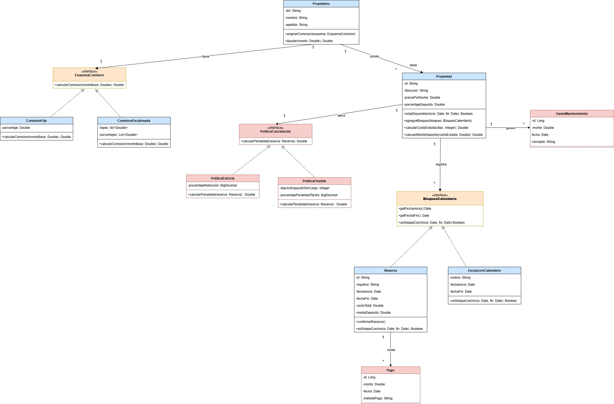
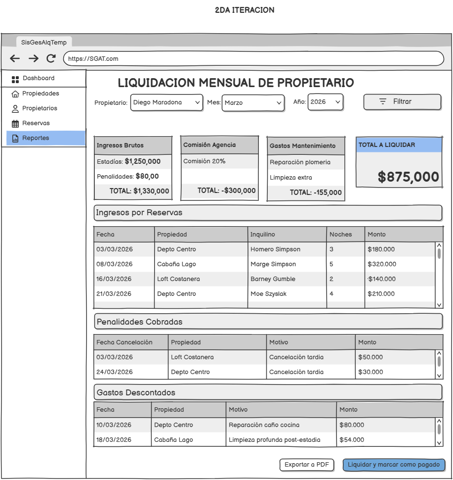

# Diseño y Planificación - Iteración 2

---

## Trabajo en equipo

A continuación se detalla el trabajo planificado y asignado a cada integrante para esta segunda y última iteración:

| Integrante         | Tareas Asignadas (Basadas en la sección "Tareas") |
|--------------------|---------------------------------------------------|
| **Bauer Luciano** | HU-09: Cancelación de Reservas HU-10: Aplicación de Penalidades HU-13: Historial y Reportes HU-14: Refactoring Técnico |
| **Olivieri Ricardo**| HU-08: Registro de Cobros HU-11: Registro de Gastos HU-12: Liquidación a Propietarios |

---

## Diseño OO

El siguiente diagrama de clases UML refleja las nuevas entidades (Pagos, Gastos, Liquidaciones) y la evolución del modelo de dominio para la etapa financiera:

#### `En color rojo son las nuevas clases e interfaces`
---

## Wireframe y caso de uso

La siguiente imagen refleja cómo se vería la pantalla del módulo de Liquidaciones y Reportes:

---

## Backlog de iteración

A continuación, se enumeran las **7 Historias de Usuario (HUs)** correspondientes a la Iteración 2 para alcanzar el 100% de la funcionalidad (Release v1.0):

### **HU-08: Registro de Cobros**

> **Como** administrador,  

> **quiero** registrar pagos asociados a las reservas,  

> **para** llevar el control de señas, pagos parciales y saldos al ingreso.

**Criterios de aceptación:**

- Se pueden registrar múltiples pagos (entregas) para una misma reserva.

- El sistema valida que la suma de los pagos no supere el monto total de la reserva.

- Se puede consultar el saldo pendiente de una reserva.

### **HU-09: Cancelación de Reservas**

> **Como** administrador,  

> **quiero** procesar la anulación de una reserva en el sistema,  

> **para** liberar el calendario.

**Criterios de aceptación:**

- Permite cambiar el estado de una reserva a "Cancelada".

- Una vez que la reserva pasa a estado 'Cancelada', sus fechas quedan liberadas y el sistema debe permitir que otro cliente reserve en esos mismos días sin que salte el error de solapamiento de fechas.

### **HU-10: Aplicación de Penalidades**

> **Como** administrador,  

> **quiero** que el sistema aplique automáticamente la política de cancelación correspondiente,  

> **para** determinar qué monto retener como penalidad según la anticipación.

**Criterios de aceptación:**

- El cálculo de la penalidad depende de la política de la propiedad (Ej: Estricta, Flexible) y los días previos al ingreso.

- El diseño debe permitir agregar nuevas políticas a futuro sin modificar la reserva.

### **HU-11: Registro de Gastos**

> **Como** administrador,  

> **quiero** registrar gastos de mantenimiento asociados a una propiedad,  

> **para** poder deducirlos en el cierre de mes.

**Criterios de aceptación:**

- Permite registrar el monto, fecha y concepto de un gasto asociado a una propiedad específica.

### **HU-12: Liquidación a Propietarios**

> **Como** administrador,  

> **quiero** generar liquidaciones mensuales por propietario,  

> **para** saber cuánto dinero debemos transferirles.

**Criterios de aceptación:**

- El sistema genera un resumen mensual para un propietario dado.

- La fórmula debe calcular: (Ingresos por estadías terminadas + Penalidades retenidas a su favor) - Comisiones Inmobiliarias - Gastos de mantenimiento del mes.

### **HU-13: Historial y Reportes**

> **Como** administrador,  

> **quiero** consultar estadísticas clave del negocio,  

> **para** la toma de decisiones.

**Criterios de aceptación:**

- Existe una opción para consultar el historial de reservas/ocupación por propiedad.

- Existe una opción para consultar los ingresos totales generados por un propietario en un período de fechas determinado.

### **HU-14: Refactoring Técnico**

> **Como** equipo de desarrollo,  

> **queremos** refactorizar y optimizar el código de la iteración 1,  

> **para** garantizar la mantenibilidad del sistema a largo plazo.

**Criterios de aceptación:**

- Se mejora el código escrito en la Iteración 1 solucionando los problemas detectados en la retrospectiva (ej: cambiar `Double` por `BigDecimal` para mayor precisión monetaria).

- Se optimizan las consultas a la base de datos (PostgreSQL) para que el sistema traiga la información relacionada en un solo viaje, mejorando el rendimiento general.

---

## Tareas

Lista de tareas técnicas necesarias para completar con éxito las historias de usuario de esta iteración:

### Tareas HU-08 (Cobros)

- `T-08.1 (Entidad)`: Crear clase `Pago` (monto, fecha, metodoPago).

- `T-08.2 (Relación)`: Configurar relación `@OneToMany` entre `Reserva` y `Pago`.

- `T-08.3 (Servicio)`: Implementar método `registrarPago(idReserva, pago)` y validaciones de saldo.

### Tareas HU-09 (Cancelación)

- `T-09.1 (Entidad)`: Modificar `Reserva` para agregar el atributo `estado` (Enum: ACTIVA, CANCELADA, FINALIZADA).

- `T-09.2 (Lógica)`: Modificar el método `seSolapaCon` para que ignore las reservas en estado CANCELADA.

- `T-09.3 (Controlador)`: Crear endpoint de anulación `PUT /api/reservas/{id}/cancelar`.

### Tareas HU-10 (Penalidades)

- `T-10.1 (Patrón)`: Crear interfaz `PoliticaCancelacion` (Patrón Strategy) con método `calcularPenalidad(reserva)`.

- `T-10.2 (Clases)`: Implementar políticas concretas (Estricta, Flexible, etc.).

- `T-10.3 (Servicio)`: Al cancelar en `ReservaService`, invocar la política para setear el nuevo valor de `montoPenalidad` en la Reserva.

### Tareas HU-11 (Gastos)

- `T-11.1 (Entidad)`: Crear clase `GastoMantenimiento`.

- `T-11.2 (Relación)`: Vincular `GastoMantenimiento` con `Propiedad` (`@ManyToOne`).

- `T-11.3 (Controlador/Repo)`: Implementar el CRUD básico de gastos.

### Tareas HU-12 (Liquidaciones)

- `T-12.1 (DTO)`: Crear clase/DTO `LiquidacionMensualResponse` para devolver el desglose de números.

- `T-12.2 (Servicio)`: Crear `LiquidacionService` con método `generarLiquidacion(idPropietario, mes, anio)`.

- `T-12.3 (Lógica JPA)`: Armar queries en los repositorios para filtrar Reservas y Gastos por mes y propietario.

### Tareas HU-13 (Reportes)

- `T-13.1 (Servicio/Repo)`: Crear métodos de agregación en JPQL para traer historial por Propiedad.

- `T-13.2 (Controlador)`: Implementar endpoints GET de analíticas (Ej: `/api/reportes/ingresos-propietario/{id}`).

\### Tareas HU-14 (Refactoring)

\- `T-14.1`: Revisión general de código, limpieza de imports y extracción de métodos largos en los Services de la Iteración 1.

